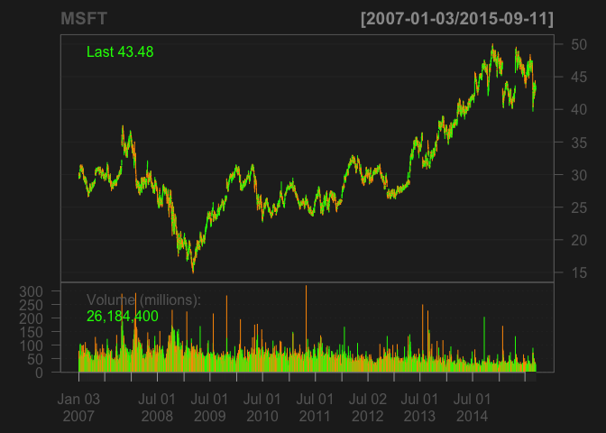
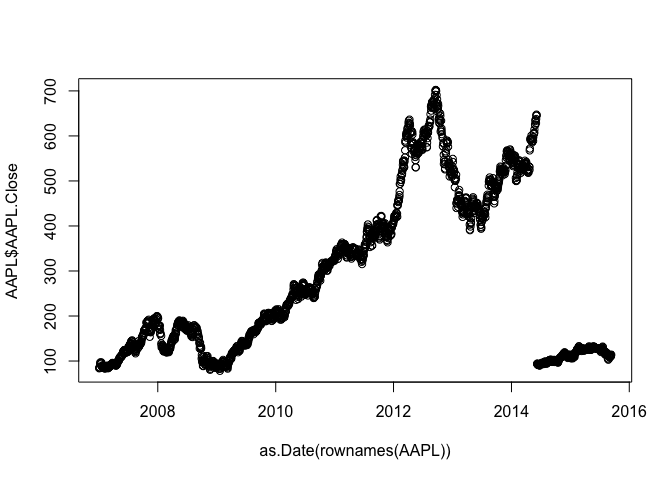

# analysis
aaron gowins  
August 12, 2015  


```r
library(quantmod)
```

```
## Warning: package 'quantmod' was built under R version 3.1.3
```

```
## Loading required package: xts
## Loading required package: zoo
```

```
## Warning: package 'zoo' was built under R version 3.1.3
```

```
## 
## Attaching package: 'zoo'
## 
## The following objects are masked from 'package:base':
## 
##     as.Date, as.Date.numeric
## 
## Loading required package: TTR
## Version 0.4-0 included new data defaults. See ?getSymbols.
```

```r
getSymbols('MSFT',src='yahoo')
```

```
##     As of 0.4-0, 'getSymbols' uses env=parent.frame() and
##  auto.assign=TRUE by default.
## 
##  This  behavior  will be  phased out in 0.5-0  when the call  will
##  default to use auto.assign=FALSE. getOption("getSymbols.env") and 
##  getOptions("getSymbols.auto.assign") are now checked for alternate defaults
## 
##  This message is shown once per session and may be disabled by setting 
##  options("getSymbols.warning4.0"=FALSE). See ?getSymbols for more details.
```

```
## [1] "MSFT"
```

```r
getSymbols('AAPL',src='yahoo')
```

```
## [1] "AAPL"
```

```r
head(MSFT)
```

```
##            MSFT.Open MSFT.High MSFT.Low MSFT.Close MSFT.Volume
## 2007-01-03     29.91     30.25    29.40      29.86    76935100
## 2007-01-04     29.70     29.97    29.44      29.81    45774500
## 2007-01-05     29.63     29.75    29.45      29.64    44607200
## 2007-01-08     29.65     30.10    29.53      29.93    50220200
## 2007-01-09     30.00     30.18    29.73      29.96    44636600
## 2007-01-10     29.80     29.89    29.43      29.66    55017400
##            MSFT.Adjusted
## 2007-01-03      24.28526
## 2007-01-04      24.24460
## 2007-01-05      24.10634
## 2007-01-08      24.34220
## 2007-01-09      24.36659
## 2007-01-10      24.12260
```

```r
barChart(MSFT)
```

 

```r
barChart(AAPL)
```

 

```r
MSFT<-as.data.frame(MSFT)
head(MSFT)
```

```
##            MSFT.Open MSFT.High MSFT.Low MSFT.Close MSFT.Volume
## 2007-01-03     29.91     30.25    29.40      29.86    76935100
## 2007-01-04     29.70     29.97    29.44      29.81    45774500
## 2007-01-05     29.63     29.75    29.45      29.64    44607200
## 2007-01-08     29.65     30.10    29.53      29.93    50220200
## 2007-01-09     30.00     30.18    29.73      29.96    44636600
## 2007-01-10     29.80     29.89    29.43      29.66    55017400
##            MSFT.Adjusted
## 2007-01-03      24.28526
## 2007-01-04      24.24460
## 2007-01-05      24.10634
## 2007-01-08      24.34220
## 2007-01-09      24.36659
## 2007-01-10      24.12260
```

```r
plot(as.Date(rownames(MSFT)),MSFT$MSFT.Close)
```

 

```r
AAPL<-as.data.frame(AAPL)
head(AAPL)
```

```
##            AAPL.Open AAPL.High AAPL.Low AAPL.Close AAPL.Volume
## 2007-01-03     86.29     86.58    81.90      83.80   309579900
## 2007-01-04     84.05     85.95    83.82      85.66   211815100
## 2007-01-05     85.77     86.20    84.40      85.05   208685400
## 2007-01-08     85.96     86.53    85.28      85.47   199276700
## 2007-01-09     86.45     92.98    85.15      92.57   837324600
## 2007-01-10     94.75     97.80    93.45      97.00   738220000
##            AAPL.Adjusted
## 2007-01-03      11.19449
## 2007-01-04      11.44295
## 2007-01-05      11.36147
## 2007-01-08      11.41757
## 2007-01-09      12.36603
## 2007-01-10      12.95782
```

```r
plot(as.Date(rownames(AAPL)),AAPL$AAPL.Close)
```

 

```r
difference<-c(AAPL$AAPL.Close[1],diff(AAPL$AAPL.Close))
AAPL$percent_change<-(difference/AAPL$AAPL.Close)*100
head(AAPL)
```

```
##            AAPL.Open AAPL.High AAPL.Low AAPL.Close AAPL.Volume
## 2007-01-03     86.29     86.58    81.90      83.80   309579900
## 2007-01-04     84.05     85.95    83.82      85.66   211815100
## 2007-01-05     85.77     86.20    84.40      85.05   208685400
## 2007-01-08     85.96     86.53    85.28      85.47   199276700
## 2007-01-09     86.45     92.98    85.15      92.57   837324600
## 2007-01-10     94.75     97.80    93.45      97.00   738220000
##            AAPL.Adjusted percent_change
## 2007-01-03      11.19449    100.0000000
## 2007-01-04      11.44295      2.1713706
## 2007-01-05      11.36147     -0.7172264
## 2007-01-08      11.41757      0.4914040
## 2007-01-09      12.36603      7.6698744
## 2007-01-10      12.95782      4.5670043
```

```r
difference<-c(MSFT$MSFT.Close[1],diff(MSFT$MSFT.Close))
MSFT$percent_change<-(difference/MSFT$MSFT.Close)*100
head(MSFT)
```

```
##            MSFT.Open MSFT.High MSFT.Low MSFT.Close MSFT.Volume
## 2007-01-03     29.91     30.25    29.40      29.86    76935100
## 2007-01-04     29.70     29.97    29.44      29.81    45774500
## 2007-01-05     29.63     29.75    29.45      29.64    44607200
## 2007-01-08     29.65     30.10    29.53      29.93    50220200
## 2007-01-09     30.00     30.18    29.73      29.96    44636600
## 2007-01-10     29.80     29.89    29.43      29.66    55017400
##            MSFT.Adjusted percent_change
## 2007-01-03      24.28526    100.0000000
## 2007-01-04      24.24460     -0.1677357
## 2007-01-05      24.10634     -0.5735493
## 2007-01-08      24.34220      0.9689308
## 2007-01-09      24.36659      0.1001302
## 2007-01-10      24.12260     -1.0114599
```

```r
library(Hmisc)
```

```
## Warning: package 'Hmisc' was built under R version 3.1.3
```

```
## Loading required package: grid
## Loading required package: lattice
## Loading required package: survival
## Loading required package: splines
## Loading required package: Formula
```

```
## Warning: package 'Formula' was built under R version 3.1.3
```

```
## Loading required package: ggplot2
```

```
## Warning: package 'ggplot2' was built under R version 3.1.3
```

```
## 
## Attaching package: 'Hmisc'
## 
## The following object is masked from 'package:quantmod':
## 
##     Lag
## 
## The following objects are masked from 'package:base':
## 
##     format.pval, round.POSIXt, trunc.POSIXt, units
```

```r
cor.test(AAPL$percent_change,MSFT$percent_change)
```

```
## 
## 	Pearson's product-moment correlation
## 
## data:  AAPL$percent_change and MSFT$percent_change
## t = 8.5416, df = 2187, p-value < 2.2e-16
## alternative hypothesis: true correlation is not equal to 0
## 95 percent confidence interval:
##  0.1388257 0.2199165
## sample estimates:
##       cor 
## 0.1796763
```

