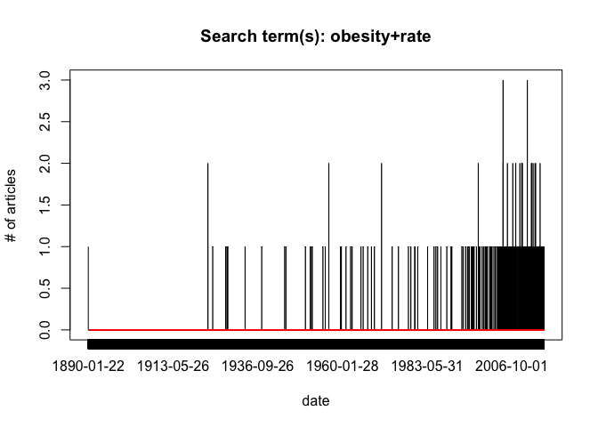

# NYtimes
aaron gowins  
June 1, 2015  


```r
library(SnowballC)
library(tm)
library(qdap)
library(ggplot2)
library(scales)
library(dplyr)
library(wordcloud)
```


## NYtimes article scrape


```r
#library(RISmed)
library(plyr)
```

```
## Warning: package 'plyr' was built under R version 3.1.3
```


We can make a new word cloud for this search, we have added a large amount of text so we need to refresh docs. We follow the same general strategy as the first time, with parameters appropriate for a larger file. 

```r
library(RJSONIO)
library(RCurl)
```

```
## Warning: package 'RCurl' was built under R version 3.1.3
```

```
## Loading required package: bitops
```

```r
### set parameters ###
api <- "d3246dfad11afd9de210ed59189fb834:2:72441336" ###### <<<API key goes here!!

q <- "obesity+rate" # Query string, use + instead of space
records <- 500 #how many results do we want? (Note limitations)
pageRange <- 0:(records/10-1)

# get data 
dat <- c()

for (i in pageRange) {
   # concatenate URL for each page
   uri <- paste0("http://api.nytimes.com/svc/search/v2/articlesearch.json?q=", q, "&page=", i, "&fl=pub_date&api-key=", api)
   d <- getURL(uri)
   res <- fromJSON(d,simplify = FALSE)
   dat <- append(dat, unlist(res$response$docs))  # convert the dates to a vector and append
 }

# establish date range
dat.conv <- strptime(dat, format="%Y-%m-%d") # need to convert dat into POSIX format
daterange <- c(min(dat.conv), max(dat.conv))
dat.all <- seq(daterange[1], daterange[2], by="day") # all possible days

# aggregate counts for dates and coerce into a data frame
cts <- as.data.frame(table(dat))

# compare dates from counts dataframe with the whole data range
# assign 0 where there is no count, otherwise take count
# (take out PSD at the end to make it comparable)
dat.all <- strptime(dat.all, format="%Y-%m-%d")
# can't seem to be able to compare Posix objects with %in%, so coerce them to character for this:
freqs <- ifelse(as.character(dat.all) %in% as.character(strptime(cts$dat, format="%Y-%m-%d")), cts$Freq, 0)

plot (freqs, type="l", xaxt="n", main=paste("Search term(s):",q), ylab="# of articles", xlab="date")
axis(1, 1:length(freqs), dat.all)
lines(lowess(freqs, f=.2), col = 2)
```

 

